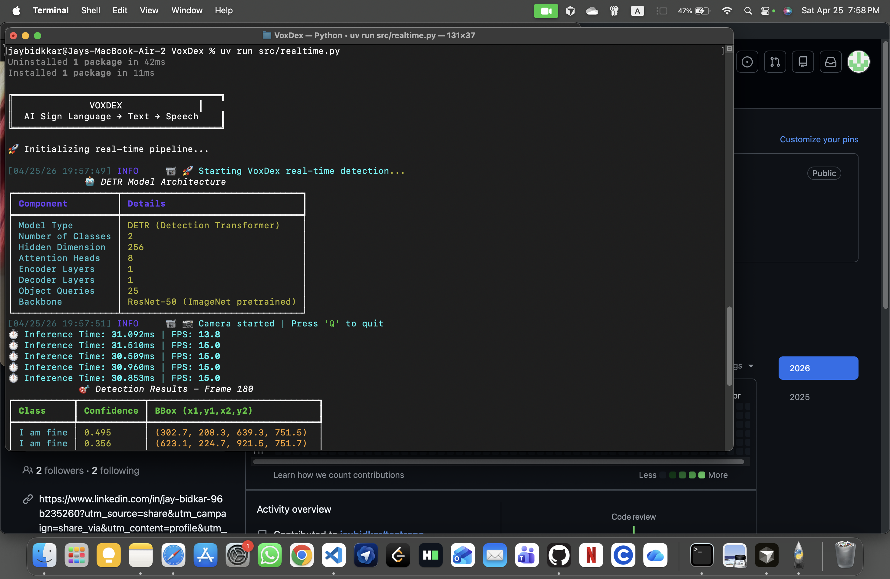

# VoxDex - Real-Time Sign Language to Speech System

## Project Description

VoxDex is a real-time AI system designed to interpret sign language gestures from webcam input and convert them into readable text, with optional text-to-speech output.  
The project focuses on building an accessibility-oriented communication interface by combining computer vision and transformer-based deep learning.

VoxDex operates as a complete pipeline:
- Captures live video from a webcam
- Detects and classifies sign gestures in real time
- Converts recognized gestures into text
- Optionally speaks detected output for assisted communication


## Features

- Real-time sign language detection from webcam streams
- DETR-based transformer detection model for gesture recognition
- OpenCV-powered frame capture and visualization pipeline
- High-FPS inference for responsive live interaction
- Modular Python architecture for maintainability and extension
- Optional text-to-speech output integration
- Ready for integration with video call workflows (Zoom/Google Meet via OBS)

## System Architecture

VoxDex follows a structured real-time inference pipeline:

1. **Webcam Input**  
   Live video frames are captured using OpenCV.

2. **Frame Preprocessing**  
   Frames are formatted and prepared for model inference.

3. **DETR Model Inference**  
   A transformer-based object detection model (PyTorch implementation) processes each frame.

4. **Gesture Classification**  
   Detected hand-sign regions are assigned class labels with confidence scores.

5. **Text Generation**  
   Stable predictions are converted into textual output for communication.

6. **Optional Speech Output**  
   Generated text can be passed to a speech engine for audio feedback.

Core technologies include **PyTorch**, **OpenCV**, and a **transformer-based detection backbone (DETR)** for robust real-time performance.

## Setup Instructions

```bash
pip install uv
git clone <your-repo>
cd VoxDex
uv sync
```

## How to Run

### Real-time Detection

```bash
uv run src/realtime.py
```

Notes:
- Press `Q` to quit the live session.
- Ensure a webcam is connected and accessible.
- Update the checkpoint path in the code if required for your environment.

## Model Training

The training workflow is designed for custom gesture datasets:

1. Collect and organize gesture image data.
2. Annotate data using Label Studio.
3. Train the detection model through the DETR-based training pipeline.

Run training with:

```bash
uv run src/train.py
```

## Use Cases

- Accessibility support for hearing- and speech-impaired users
- Real-time assistive communication during daily interactions
- Video call assistance through external streaming tools
- AI-driven gesture interfaces for human-computer interaction

## Future Improvements

- Full sentence formation from continuous gesture streams
- Enhanced NLP integration for contextual text refinement
- Multi-language output support
- Deployment as a web-based application
- Deeper integration with Zoom and Google Meet environments

## Author

Jay - VoxDex Developer

## Demo

Demo coming soon.
